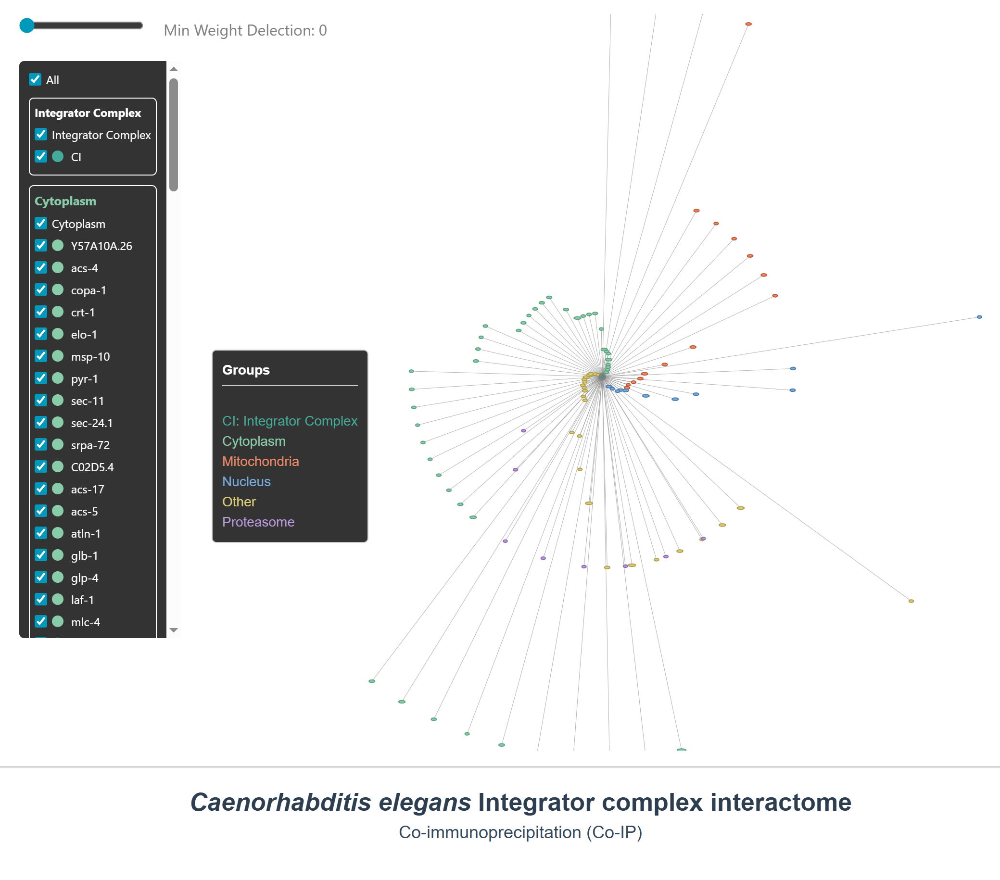

# 🧬 *C. elegans* Integrator Complex Interactome

** Graphical representation of the *C. elegans* Integrator complex interactome.**

The Integrator complex is shown as the central node of the diagram. Interacting proteins are depicted as surrounding colored dots:
* 🔵 **Blue:** Nuclear proteins
* 🔴 **Red:** Mitochondrial proteins
* 🟢 **Green:** Cytoplasmic proteins
* 🟣 **Purple:** Proteasome proteins
* 🟡 **Yellow:** Proteins with unassigned cellular compartment

Line length is proportional to the spectral count value from IP-MS (Supplementary Table 1). Proteins with strong interactions are located closer to the Integrator central node than those with low spectral count values, indicating weaker interactions. 

An interactive and detailed view of this model is available in the supplementary files below.

---

## 🌐 Interactive Visualizations

Click on the links below to open and explore the interactive network models directly in your web browser:

* [🔗 **Explore the *C. elegans* Integrator Complex Interactome**](https://rolopeg.github.io/Cabello-Lab/Integrator%20complex%20interactome%20website/C_elegans_IC_interactome.html)
  
*(Note: This link will open a new interactive webpage where you can zoom, pan, and hover over the nodes for more detailed information).*

