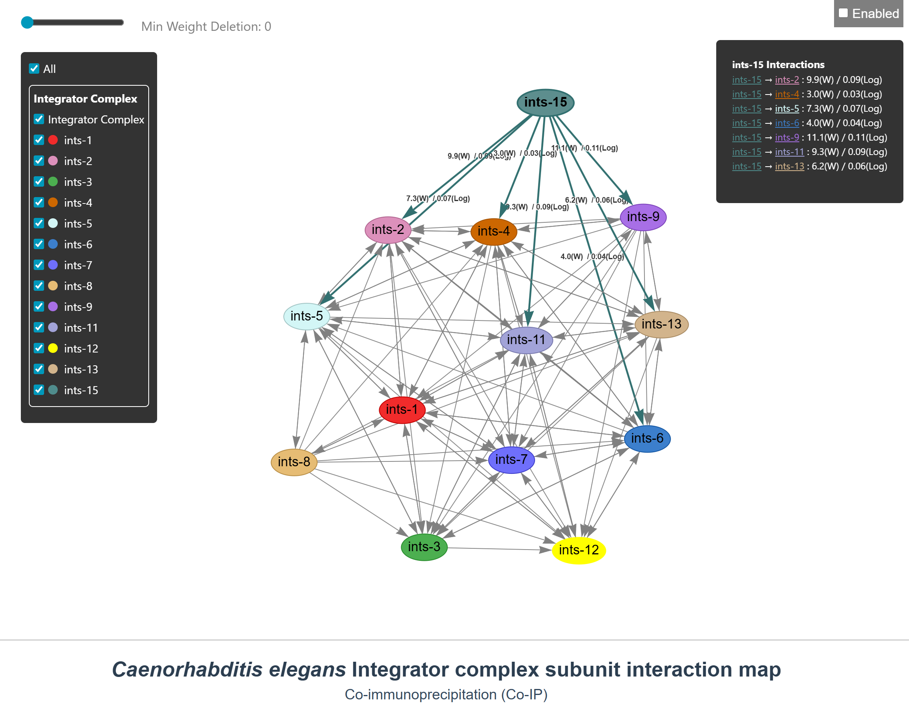

# 🧬 *C. elegans* Integrator Complex Subunit Interaction Map

This repository section contains supplementary information and interactive models regarding the structure and subunit interactions of the *C. elegans* Integrator complex.
Predicted structure of the *C. elegans* Integrator complex, including subunits INTS-1, INTS-2, INTS-3, INTS-4, INTS-5, INTS-6, INTS-7, INTS-8, INTS-9, INTS-11, INTS-12, INTS-13 and INTS-15. 

This network depicts subunits co-immunoprecipitated with each Integrator subunit in IP-MS experiments. 
* **Arrows:** Point to the bait subunit. 
* **Connection Strength:** High spectral count values in the IP-MS analysis are represented by clicking the connections in the dynamic model. 

---

## 🌐 Interactive Visualization (Interaction Map)

An interactive and detailed view of the dynamic model described in the article is available online. You can use the interactive web interface to isolate specific subunits, filter interactions by weight, and explore detailed spectral count values.

Click the link below to open the visualization directly in your web browser:

* [🔗 **Explore the *C. elegans* Integrator Subunit Interaction Map**](https://rolopeg.github.io/Cabello-Lab/Integrator%20complex%20structure%20website/C_elegans_IC_subunit_interaction_map.html)

*(Note: In the interactive interface, you can use the left sidebar to toggle specific subunits on or off, adjust the minimum weight deletion slider at the top, and click on individual nodes to view specific interaction metrics in the right panel).*

