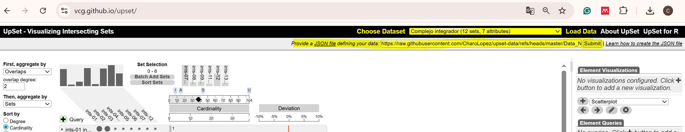

# 📊 Interactome Visualization (UpSet)

This directory contains the interaction data of the Integrator complex (`interactome.csv`), specifically prepared to be interactively explored using the **UpSet** tool.

## 🛠️ Instructions to load the data online

To reproduce and explore the intersection plot from our study, you do not need to install any software. Just follow these steps:

1. Go to the UpSet web application:[https://vcg.github.io/upset/](https://vcg.github.io/upset/)
2. On the top right navigation bar, click on the **"Load Data"** button.
3. You will see a text box that says *"Provide a JSON file defining your data:"* (it also accepts CSV). Copy and paste the following exact URL from our repository:

   ```text
   https://raw.githubusercontent.com/rolopeg/Cabello-Lab/refs/heads/main/UpSet/interactome.csv
4. Click the "Submit" button.


